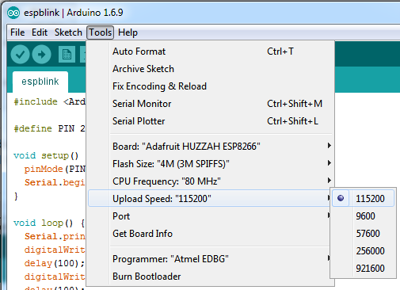
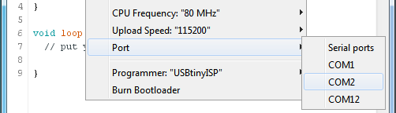
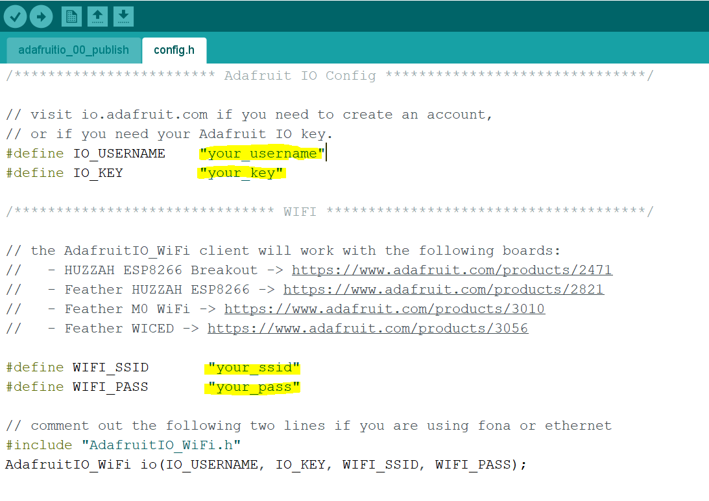

# Setting Up The Feather Huzzah

Before we start working on the IOT projects, let’s install all the necessary software and drivers on your laptop. 

**Configuring Arduino IDE**

1.  <mark style="background-color:coral;"><b>This first activity is essential to get the IoT board communicating with your computer, and omitting it, or not completing every step in the order outlined below, is often the source of errors in this workshop.</b></mark> A computer needs the appropriate driver to be able to talk to the Feather Huzzah through the USB cable. Your computer does not have this driver by default, so you must manually install the necessary driver:
    -   Go to the Silicon Labs website and [download the appropriate driver for your computer's operating system](https://www.silabs.com/developers/usb-to-uart-bridge-vcp-drivers?tab=downloads){:target="_blank"}.
    -   Clicking on the name of the driver should download a .zip file. Find the .zip file in your "**Downloads**" folder. Right-click the .zip file and select "**Extract All...**"
    -   Now that you've downloaded the driver package, you have to install the driver. Go into the unzipped folder and find the installer .inf (or "**Setup Information**") file
    -   Right-click on this file, select "**Install**", and follow any installer instructions
    -   If you encounter any problems with these steps, please bring them to the instructor's attention :)
2.  If you haven't already download the [Arduino IDE](http://bit.ly/2LIKN2A){:target="_blank"} & install it. *Note:** The software is in a zip file, so it may take a few steps before you are asked for your password during the install process. If you haven’t entered your password, you’re not done yet
    -   **REBOOT your computer now!** This is Very Important to do!
3.  In the Arduino IDE you just installed go to **Sketch -> Include Library -> Manage Libraries**
    -   Now search for "Adafruit IO Arduino" and click **Install**.  If you are prompted to add dependencies say yes.
    -   Search for "Adafruit MQTT" and click **Install**
    -   Search for "ArduinoHttpClient" and click **Install**
4.  Open the following URL in your web browser: [https://arduino.esp8266.com/stable/package_esp8266com_index.json](https://arduino.esp8266.com/stable/package_esp8266com_index.json){:target="_blank"}
    -   Copy the full URL of the web page as you’ll need it in the next step (the full URL is: http://arduino.esp8266.com/stable/package_esp8266com_index.json)
    -   In your Arduino IDE, go to the **File** menu **-> Preferences** (on a Mac **Arduino** menu **-> Preferences**). A window will pop up. Under the **Settings** tab, click the box next to **Additional Board Manager URLs** and copy/paste the above link in the field beside it
    -   Click **OK**
5.  Go to **Tools -> Board -> Board Manager**. In the pop-up window, search for the esp8266 package. Click on the result and an install button will show up in the bottom right corner. Click it
6.  Double-check you have the right settings under **Tools**
    -   Select: **Tools -> Board -> Adafruit Feather HUZZAH ESP8266**
    -   Select: **Tools -> CPU Frequency -> 80 MHz**
    -   Select: **Tools -> Upload Speed -> 115200**

    

    

7.  Connect the Feather Huzzah to your laptop. Go to **Tools -> Port ->** (select the right COM port)
    -   On a Mac, the port is labelled "SLAB_USBtoUART"
    -   (Note: you may have to reselect port when you unplug and replug the cable into your computer)
8.  In your web browser, go to [https://io.adafruit.com/](https://io.adafruit.com/){:target="_blank"} and create an account
    -   After you’ve logged in, look at the top menu and click on **IO**
    -   On the new screen, look at the top menu and click on **My Key** (yellow key symbol)
    -   Copy the **Active Key** to your clipboard as you’ll need this in step #10 of the setup (your key should be in this format “2cf0197e930f406eb1f9374be6c87cf4”, but different of course)
9.  In Arduino IDE, go to **File -> Examples -> Adafruit IO Arduino -> adafruitio_00_publish** (this is near the bottom of the menu). A window should pop up with some code in it
10.  Click on the **config.h** tab. There are four lines of code highlighted below that need to be filled in:

     

11.  Replace the highlighted sections with the following, taking care to **keep the quotation marks**, and make sure that the  WIFI with WIFI_SSID: "dsc" is on using other device like your phone to verify:

<pre><code>#define IO_USERNAME: "Your Adafruit IO username"
#define IO_KEY: "Your Adafruit IO key"
#define WIFI_SSID: "dsc"
#define WIFI_PASS: "dsc4life"</code></pre>

**Please Note:** You will have to do this for every new project sketch you open in Arduino

**Extra:** Click **Upload** (top-left corner of the window). When it’s done uploading, wait a few seconds and then click on the **Serial Monitor** (magnifying glass in top-right corner). In the bottom right corner, make sure you select **115200**. You should see the Feather printing data to the screen!

**Extra Extra:** If you want to see the same information through the Adafruit IO interface, go to [https://learn.adafruit.com/welcome-to-adafruit-io/overview](https://learn.adafruit.com/welcome-to-adafruit-io/overview){:target="_blank"} and follow the instructions there.

**Extra Extra Extra:** When you compling or uploading the codes, If Arudoino IDE shows the errors of "No connection established. Last error: Error connect ECONNERFUSED 127.0.0.1:49818 Compliation error".  1. Run netstat -ano | findstr "49818" to find the process ID(PID) that using that port. Then use taskkill /PIO <PID> /F to stop it on windows. Or on MACOS/Linux: Run lsof -i: 49818 to find the process and then kill -9 <PID> to terminate it. 2 Check your firewall settings. Allow the Arduino IDE connection/traffice through firewall. 3. Restart the Arduino IDE.

 [NEXT STEP: Reading Light from a Sensor](act-2.html){: .btn .btn-blue }
