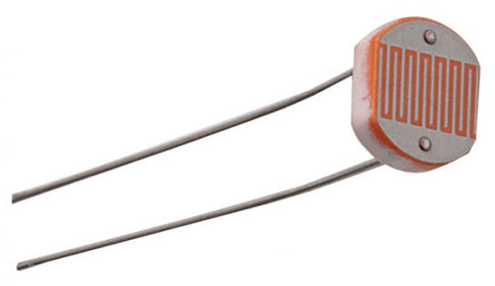
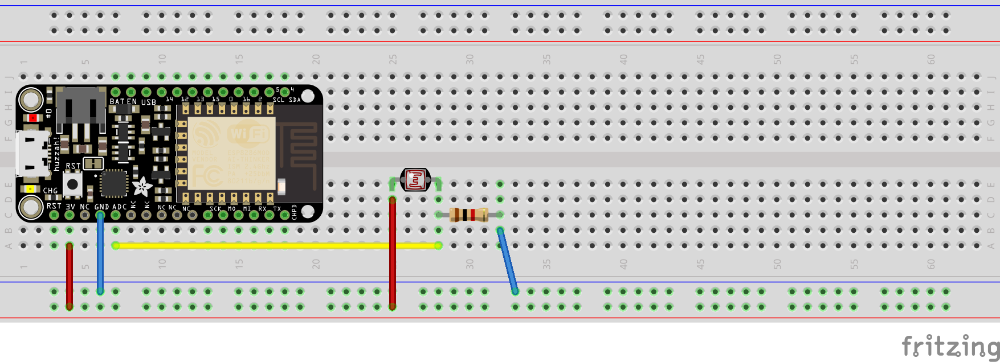
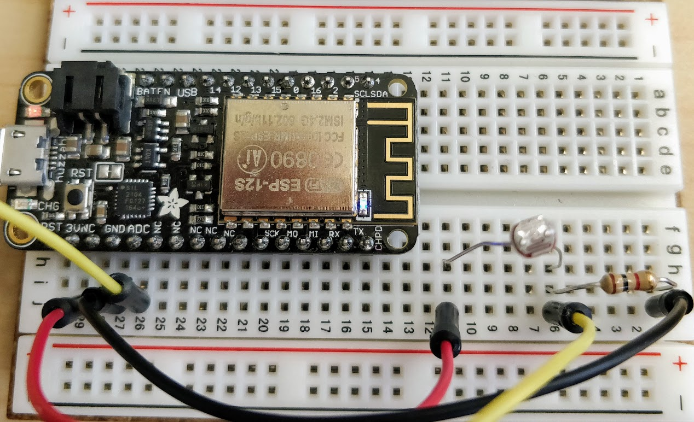
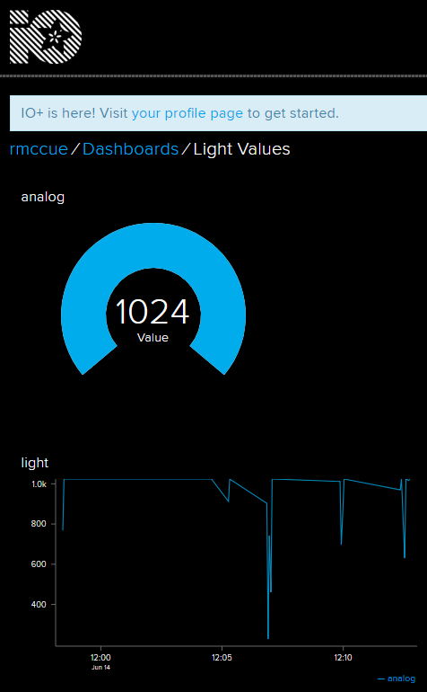

# Reading Light from a Sensor

_Adapted from <a href="https://learn.adafruit.com/adafruit-io-basics-analog-input" target="_blank">Adafruit IO: Basics - AnalogIn</a> by Todd Treece_

In this tutorial, you will learn how to detect light with a sensor and relay that info to Adafruit IO. If you or your group have any questions, or get stuck as you work through this in-class exercise, please ask the instructor for assistance.  Have fun!



<br>**List of Materials**

-   Adafruit Feather HUZZAH board, breadboard, USB cable
-   Photoresistor or light sensor (see photo) 
-   3 jumper wires
-   1 k-ohm resistor in order for this to work (brown - black - red - gold)

<br>**Instructions**
    
1.  Log into <a href="https://io.adafruit.com/" target="_blank">io.adafruit.com</a> (if you haven’t created an account yet, you can do that now). If you're not already at your dashboards, click **IO** in the top menu to get to your dashboards. From here, click **Feeds** in the top menu. Click **+ New Feed** and name your feed “analog”
    
    
    
    -   Analog in this case refers to the type of input the computer receives -- that is, analog input rather than digital input. Analog input can give you a range of values (0‒1024 in Adafruit IO) whereas digital input can only give you 2 values (0 or 1)
    
2.  Go to **Dashboards** in the top menu. Click **+ New Dashboard**. Name the new dashboard “Light Sensor”. Once created, the new dashboard will appear on the page. Click on the name of your new dashboard.

3.  For now, the dashboard is blank
    -   Add a block by clicking the gear dropdown icon in the top right and then clicking **Create New Block**
    -   Select the **gauge**, and then click on the **analog** checkbox, and click on **Next step**
    -   Change the **Max Value** to **1024**, and click on the blue **Create Block** button
4.  We can also include a line graph to track the changes in light level
    -   Click the gear dropdown icon in the top right, and then click **Create New Block**
    -   Select the **Line Chart** option
    -   Click on the **analog** checkbox, and click on **Next step**
    -   Under **Show History**, click on the drop down menu and select **8 hours**
    -   Change the **Decimal Places** value to “0”, and click on **Create Block**
5.  Unplug the Feather from your laptop. Now we’ll wire the circuit. Remember that everything on the same row (A-E or F-J) is connected. Connect the circuit as shown on the image below. (There are also written instructions.)  _Note: if you are using a knockoff version of the feather, input and output pins may be in different locations._
    -   Place the Feather Huzzah on the far left of the bread board as you can see below
    -   Connect one end of the photoresistor to 3V
    -   Connect one end of the 1k ohm resistor to GND (ground) as a "pull-down" resistor
    -   The other ends of the photoresistor and 1k ohm resistor are connected together and to ADC (the analog to digital converter pin)
    
    <br>
    
    <!---
    -   Place the Feather Huzzah on the far left of the bread board as you can see above
    -   The **Red** wire is plugged into **J29** (3V) and **J11**
    -   The **Black** wire is plugged into **J27** (GND) and **J1**
    -   The **Yellow** wire is plugged into **J26** (ADC) and **J6**
    -   The **1K ohm resistor** is plugged into **I6** and **I1**
    -   Lastly the **light sensor** is plugged into **H11** and **H6**
    -->

    

    
    
    

6.  Open the Arduino software. Make sure you have the correct libraries installed (if not, ask an instructor). Go to **File -> Examples -> Adafruit IO Arduino -> adafruitio_08_analogin**. A new sketch should pop up. A sketch is a program or batch of instructions for our Feather HUZZAH.

7.  Click on the **config.h** tab near the top. Fill in the 4 lines of info as we did at the start of the workshop:
    ```
     #define IO_USERNAME: [Your Adafruit IO username]
     #define IO_KEY: [Your Adafruit IO key]
     #define WIFI_SSID: “dsc”
     #define WIFI_PASS: “dsc4life”
     ```

8.  Connect Feather to your laptop and **make sure the right Board and Port settings are selected**. Click the **upload** arrow (the right arrow icon in the top left corner of the window).

9.  Cover the light sensor with a finger and watch the value of the gauge decrease. Then slowly lift your finger further and further away and watch it change!

<br>[NEXT STEP: Make Your Own Weather Station](act-3.html)
