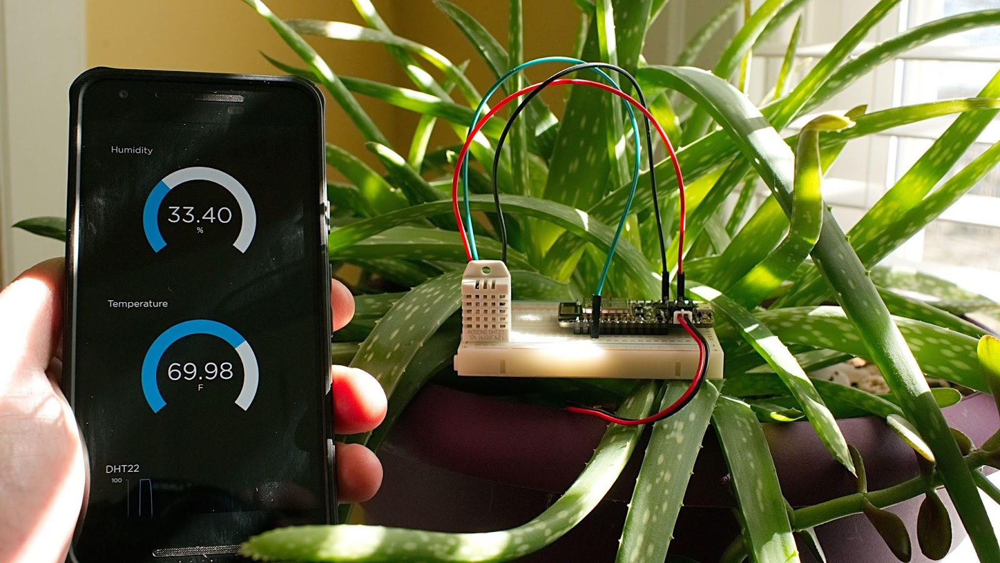
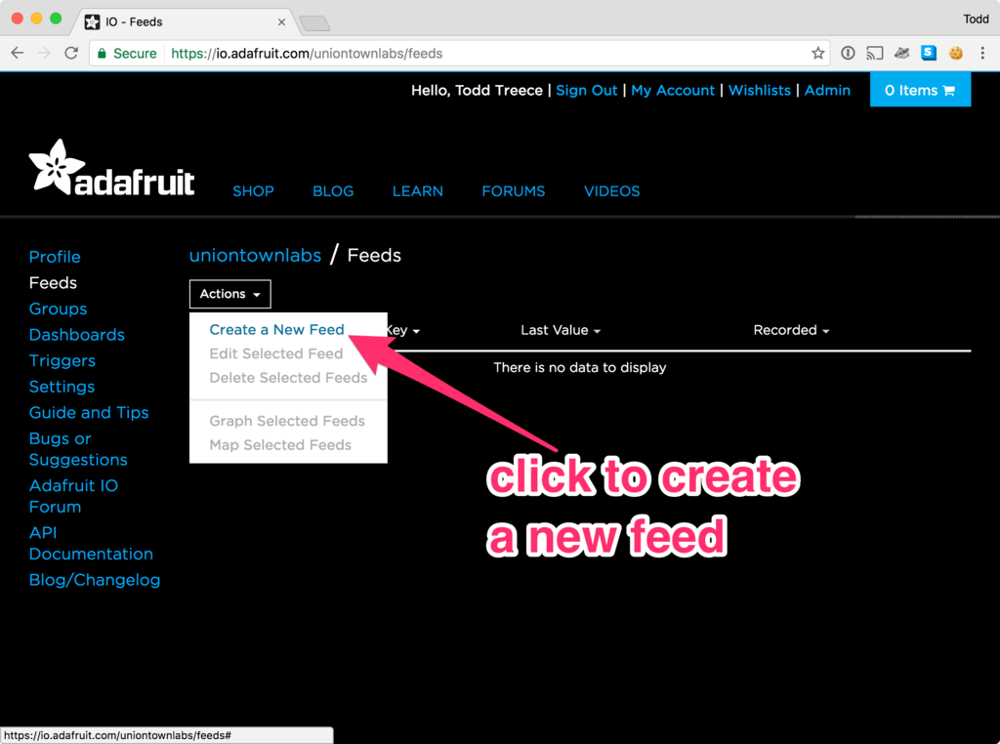
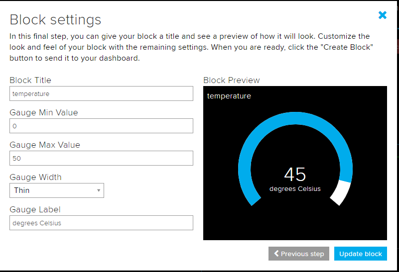
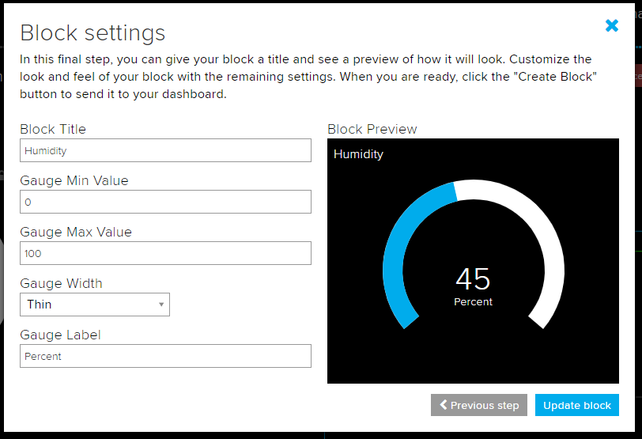
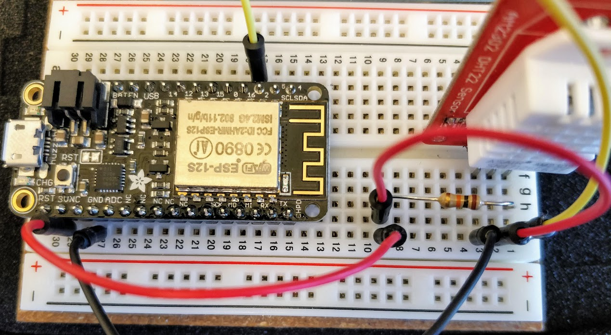
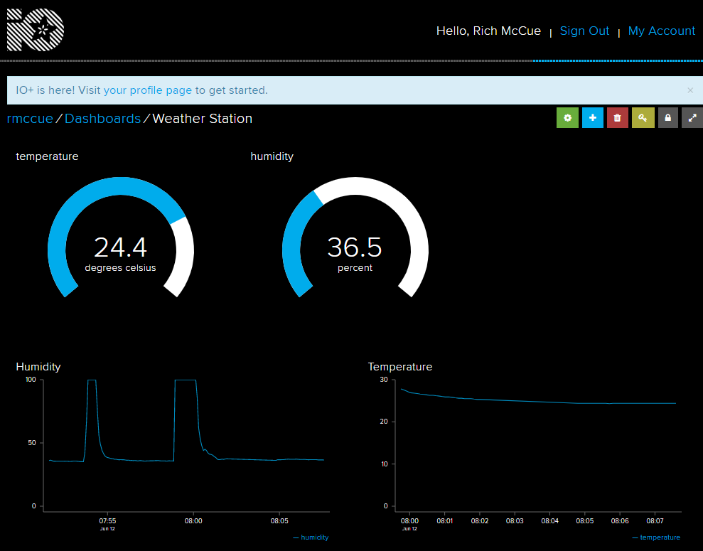

# Make Your Own Weather Station

Adapted from [Adafruit IO: Basics - Temperature and Humidity](https://learn.adafruit.com/adafruit-io-basics-temperature-and-humidity){:target="_blank"} by Todd Treece



If you or your group have any questions, or get stuck as you work through this in-class exercise, please ask the instructor for assistance.  Have fun!

In this tutorial, you will learn how to make a simple weather station that detects temperature and humidity

&nbsp;&nbsp;&nbsp;&nbsp;**List of Materials**


-   Adafruit Feather HUZZAH board, breadboard, USB cable
-   1 AM2302 DHT22 Temperature and Humidity Sensor
-   4 jumper wires - 1 long red and 1 long black wire recommended but not essential
-   1 10k ohm resistor (brown black orange) - see right

    **Instructions**

1.  Log into [io.adafruit.com](io.adafruit.com){:target="_blank"} (if you haven’t created an account yet, you can do that now). Along the left sidebar, click **Feeds** and then **Actions > Create a New Feed**. Let’s create two feeds: one for temperature (name it “temperature”) and one for humidity (name it “humidity”)

    

2.  Go to Dashboards on the left sidebar and then click **Actions > Create a New Dashboard**. Name the new dashboard anything you want. Once created, the new dashboard will appear on the page. Click on the name of your new dashboard

    
    

3.  For now, the dashboard is blank. In step #4 we’re going to add **3 different blocks**. A block displays some kind of data coming from the Feather to Adafruit IO or vice versa
    -   A **gauge** for reading temperature
    -   A **gauge** for reading humidity
    -   A **line graph** for comparing the two over the last 24 hours
4.  Click the blue plus sign to add each block to your dashboard. Add the temperature and humidity gauges, selecting the appropriate feed to read your data from. Fill out the settings as pictured below
5.  Create a Line Chart to witness a trend. Select 8 hours and 0 decimal places in the settings window and click Update Block
6.  Unplug the Feather from your laptop. Now we’ll wire the circuit. Remember that everything on the same row (A-E or F-J) is connected. Connect the circuit as shown below. (There are also written instructions.) \*\*\*the breadboards supplied with the feather huzzah - I find it useful to state which pin on the breadboard corresponds to which pin on the feather - though this is personal preference. Feel free to reject these changes!

    

7.  Begin by plugging in your Feather Huzzah board into the far left of the breadboard as shown above
8.  Plug the heat and humidity sensor facing inwards with the pins in **F1-3**
9.  Now we’re going to connect the sensor to our Feather. Using a shorter wire (of any colour), insert **one end into J1 and the other into A17 (pin ‘2’ on Feather board)**
10.  Using the **10k resistor**, connect **one end into H9 and the other into H1**
11.  Using 1 long red wire, insert **one end of the wire into J29 (corresponding to the 3V pin on the Feather)** and **the other end into J9 (connecting to a leg of the resistor)**
12.  Using 1 short red wire, insert **one end of the wire into I9** and **the other end into J2**
13.  Using the long black wire, insert one end into **J27 (connected to GND)** and **the other end into J3**
14.  Open the **Arduino software**. Make sure you have the correct libraries installed (if not, ask an instructor). Go to **File > Examples > Adafruit IO Arduino > adafruitio_15_temp_humidity**. A new sketch should pop up. A sketch is a program or batch of instructions for our Feather HUZZAH
15.  We need the DHT sensor library. Go to **Sketch > Include Library > Manage Libraries**
    -   Type “DHT sensor” into the search box. Select **DHT sensor library** and then click **Install** (bottom right corner)
    -   Type “adafruit unified sensor” into the search box. Select **Adafruit Unified Sensor** and then click **Install**
16.  We’re almost there but we need to make a few modifications to the sketch. This sketch displays the temperature in fahrenheit but we want it to be in celsius instead. Scroll down until you find the following lines:

     ```
     // save fahrenheit (or celsius) to Adafruit IO
     temperature->save(fahrenheit);
     ```
     
     Delete fahrenheit in `save(fahrenheit);` being sure to leave the brackets intact. Replace it with `celsius`, using all lowercase letters

17.  Next, we need to be able to connect to WiFi and our Adafruit account. Click on the config.h tab. In the Arduino program on your laptop, fill in the 4 lines of info as we did at the start of the workshop
18.  Connect Feather to your laptop and make sure the right Board and Port settings are selected. Click upload (the right arrow icon in the top left corner of the window). Our gauges should now display the temperature and humidity!
19.  Let’s add a couple of line charts for both temperature and humidity:
     -   Click on the blue plus sign again, and selecting the **Line Chart** option. Select **temperature**, and play around with the options and see what works best. For example, I liked to set the Y-axis Minimum to 0 and the Y-axis Maximum to 33
     -   Click on the blue plus sign again, and selecting the **Line Chart** option. Select **humidity**, and play around with the options and see what works best. For example, I liked to set the Y-axis Minimum to 0 and the Y-axis Maximum to 100



Congratulations, you’re done!

[NEXT STEP: Press a Button to Send a Message](act-4.html){: .btn .btn-blue }
