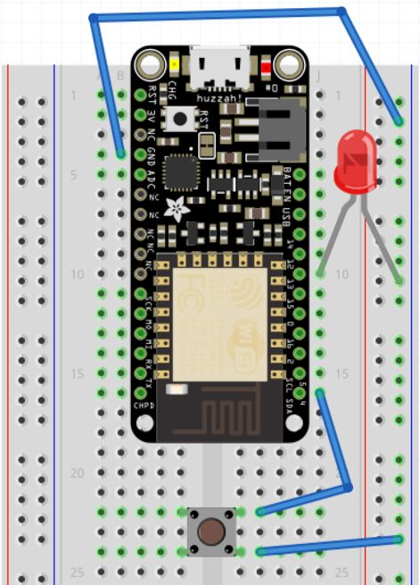
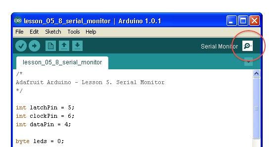
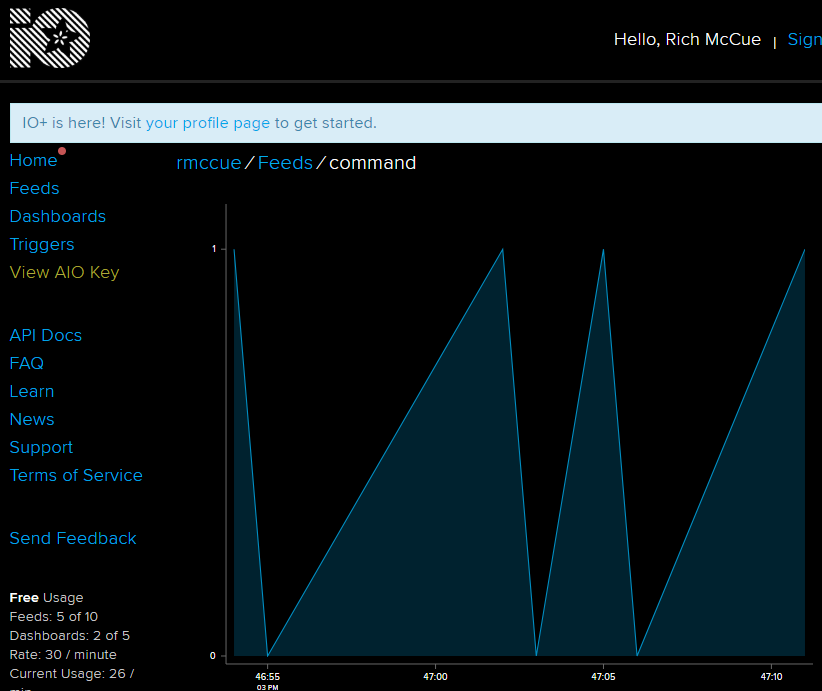
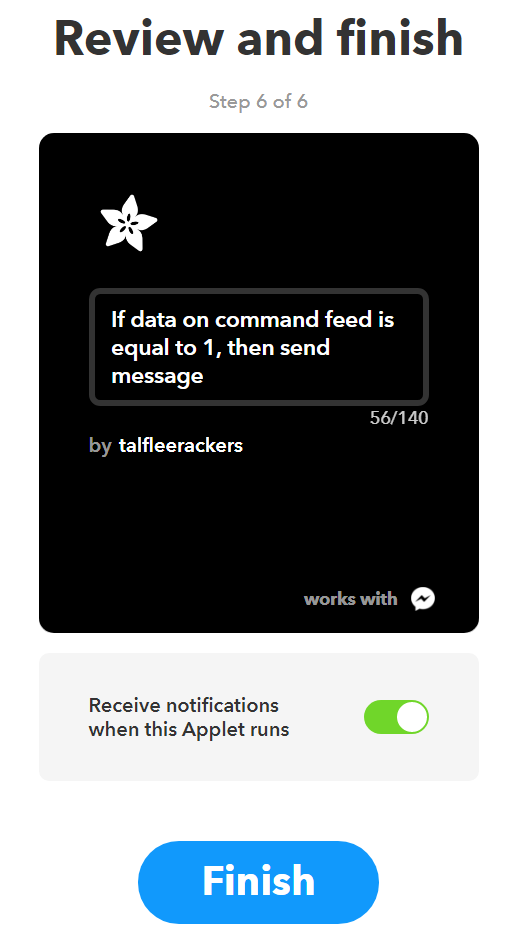
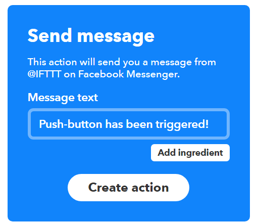

# Press a Button to Send a Message (Facebook, Twitter, Email)

<br>&nbsp;&nbsp;&nbsp;&nbsp;&nbsp;**Materials Needed**

-   1 Adafruit Feather Huzzah (a type of Arduino board)
-   1 pushbutton
-   1 breadboard
-   1 LED

    

<br>&nbsp;&nbsp;&nbsp;&nbsp;&nbsp;**Hardware Setup**

1.  Connect parts as in the diagram:
    -   The long leg of the LED should be placed with the long leg in the same row as 13 on the adafruit board and the short leg grounded
    -   The push button should be connected to ground on one side and pin 4 on the adafruit on the other side
2.  Create a new sketch and copy/paste [the code](https://bit.ly/2SOyZjC) into Arduino:
    ```
    #define LED_PIN 13
    #define BUTTON_PIN 4

    // button state
    int current = 0;
    int last = 0;

    void setup() {
        pinMode(LED_PIN, OUTPUT);
        pinMode(BUTTON_PIN, INPUT_PULLUP);
        Serial.begin(115200);
    }

    void loop() {
        // grab the current state of the button.
        // we have to flip the logic because we are
        // using INPUT_PULLUP.
        if(digitalRead(BUTTON_PIN) == LOW)
            current = 1;
        else
            current = 0;

    // return if the value hasn't changed
        if(current == last)
        return;

    Serial.println(current);
    digitalWrite(LED_PIN, current);
  
    last = current;
    }
    ```

3.  Plug your USB cable into your computer.  Go to **Tools -> Port** and select the COM port your Feather Huzzah is on. Now compile and upload code and watch the light turn on as you press the button!

    <br>
    **Triggering an Action: Create an Adafruit IO Web Feed**
    
    
4.  Click the magnifying glass in the top-right corner to open the serial monitor. The serial (named for serial communication) monitor shows you the values that the Feather is reading from the button. Now press the button and watch the output change!

5.  Exit out of all of your Arduino IDE windows, and shutdown the program.

6.  Go to [this link](https://bit.ly/2JSBlMY) and a download of an Arduino program (called a “sketch”) will automatically start. In your Arduino code editor, go to **File > Open** and select the file. Save it.
    
    
    
    -   Edit the code to add your **IO_Username**, **IO_Key**, along with the **wifi username** and **password**. You can find your IO credentials at [https://io.adafruit.com](https://io.adafruit.com){:target="_blank"} by clicking on the **IO** tab in the top menu, then clicking the yellow **My Key** option in the top menu
    -   Now compile and upload code by clicking the **Upload** arrow on the top navigation bar
    -   After the code is loaded, go to in Adafruit IO. Click **Feeds** then open your **feed** (that will be created by your IOT device).
    -   Click on the button on your Feather Huzzah, and you’ll see the graph on the Adafruit IO website update. Great job!

    <br>
    **Connecting to an IFTTT Applet**
    
    
7.  Go to [ifttt.com](https://ifttt.com/){:target="_blank"} and log in or setup an account if you haven’t already. Create a new applet on IFTTT by clicking **My Applets** and then **create your own**
8.  Search for “Adafruit”
    -   Select the **Adafruit** service
    -   Press the **Connect** button. A new window will prompt you for authorization. Press the **AUTHORIZE** button at the bottom
    -   Click **continue**.

        

    -   Click the **Add** button next to the "If This" text
    -   Search for Adafruit and select the option that appears
    -   Select **Monitor a feed on Adafruit IO**
    -   Select **command** from the drop down box, select **equal to** from the Relationship drop down, and in the value field, enter **1**. Now press **Create Trigger**
9.  Click on the **Add** button next to the "Then That" text

    

10.  Click on an output device to your liking (e.g. text, twitter, facebook, etc.).  Some ideas:
     -   Spotify - save a track, or add track to playlist
     -   Facebook messenger / sms - receive a text
     -   Email/Gmail
     -   Twitter/facebook - make a status update
     -   The list goes on! Browse around until you find something to your liking
11.  You will be asked if you want to connect to the service. Click **Connect**, and then **Accept**
12.  Click through to customize the message, and click on **continue**
13.  Click **Finish**. Now every time you press the button, you should receive a text, email, message, or call (depending on how you’ve configured it!)



Great job!

[NEXT STEP: Motion Sensor to Send a Message](act-5.html){: .btn .btn-blue }
