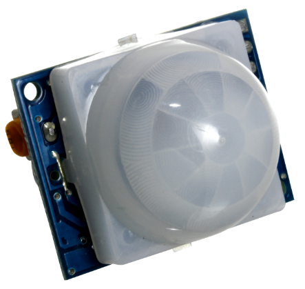
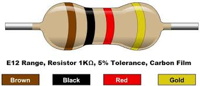
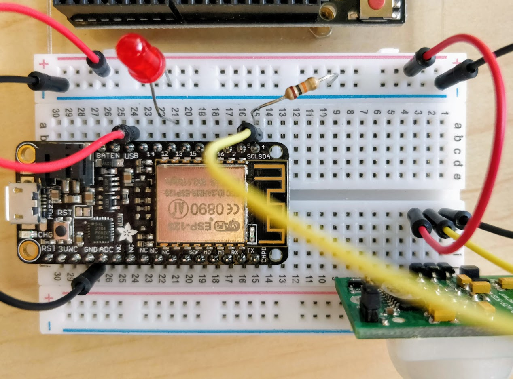

# Motion Sensor to Send a Message (Facebook, Twitter, Email)

 &nbsp;&nbsp;&nbsp;&nbsp;&nbsp;**Materials Needed**

-   1 Adafruit Feather Huzzah (a type of Arduino board)
-   1 PIR motion detector
-   1 breadboard
-   1 LED light

    

-   2 red  wires, 2 black wires, 1 other coloured wire
-   1 10K ohm resistor (brown - black - orange - gold)

 &nbsp;&nbsp;&nbsp;&nbsp;&nbsp;**Hardware Setup**

1.  Connect parts as in the diagram:
    
    
    
    -   The **PIR motion sensor** should be connected facing out in **J1** to **J3** on the breadboard
    -   The long leg of the **LED** should be placed in the same row as **pin 13** on the adafruit board and the other leg into a **“-”** hole on the edge
    -   A **black wire** should connect to the hole next to the **GND** pin, and then to a **“-”** on the edge of the board as shown above
    -   A second **black wire** should connect a hole in line with the outside prong of the **PIR** (labeled **GND** on the back of the **PIR**), and the other end in a **“-”** hole on the edge of the board
    -   A **red wire** should connect to the hole next to the **USB** pin, and then to a **“+”** pin on the edge of the board as shown above
    -   A second **red wire** should connect a hold in line with the inside prong of the **PIR** (labeled **OUT** on the back of the **PIR**), and the other end in a **“+”** hole on the edge of the board
    -   A **wire** (any colour, but yellow above) should connect to the hole next to the **SCL** pin, and the other end should connect a hole in line with the middle prong of the **PIR** (labeled **VCC**)
    -   A **10K ohm resistor** should be connected to a hole in line with the **SCL** pin, and the other end in a **“-”** hole on the edge of the board
2.  Download & the open the following file in your Arduino editor, then save it: [http://bit.ly/2JPqHTO](http://bit.ly/2JPqHTO){:target="_blank"}
3.  Plug your USB cable into your computer.  Go to **Tools -> Port** and select the port your Feather Huzzah is on
    -   Now compile and upload code, and wave your hand in front of the PIR motion sensor and watch the LED light up!
    -   **Note:** you may need to adjust the orange sensitivity & delay dials with a phillips screwdriver

     
    **Triggering an Action Online: Create an Adafruit IO Web Feed**

4.  Exit out of all of your Arduino IDE windows, and shutdown the program
5.  Download & open the following new file in your Arduino code editor, and then save it: [http://bit.ly/2JSBlMY](http://bit.ly/2JSBlMY){:target="_blank"}
    -   Edit the code to add your **IO_Username**, **IO_Key**, along with the **wifi username** and **password**. You can find your Adafruit IO credentials at [https://io.adafruit.com](https://io.adafruit.com){:target="_blank"} by clicking on the **View AIO Key** button
    -   Now compile and upload code by clicking the **Upload** arrow on the top navigation bar
    -   After the code is loaded, go into Adafruit IO. Click **Feeds** and open your command feed
    -   Click on the button on your Feather Huzzah, and you’ll see the graph on the Adafruit IO website update. Great job!

     
    **Connecting to an IFTTT Applet**
    

6.  Go to [ifttt.com](https://ifttt.com/){:target="_blank"} and log in or setup an account if you haven’t already. Create a new applet on IFTTT by clicking **My Applets** & then **New Applet** button
7.  Click on the big blue **+this** button to open service options, and search for “Adafruit”
    -   Select the **Adafruit** service
    -   Press the **Connect** button. A popup window will appear; press the **AUTHORIZE** button at the bottom
    -   Select **Monitor a feed on Adafruit IO**
    -   Select **command** from the drop down box, select equal to from the Relationship drop down, and in the value field, enter **1**. Now press **Create Trigger**
8.  Click on big blue **+that** button to select an output service
    -   Click on email (or another output device to your liking: email, twitter, facebook, etc.)
    -   You will be asked if you want to connect to the service. Click **Connect**, and then **Accept**
    -   Click through to customize the message if you want to, and click on **Create action**
    -   \*\***a warning on IFTTT states that the applet can take up to an hour to apply. It may not work for workshop attendees right away**
9.  Click Finish. Now every time you press the button, you should receive a text, email, message, or call (depending on how you’ve configured it!)

[NEXT STEP: Weasley Whereabout Clock](act-6.html){: .btn .btn-blue }
