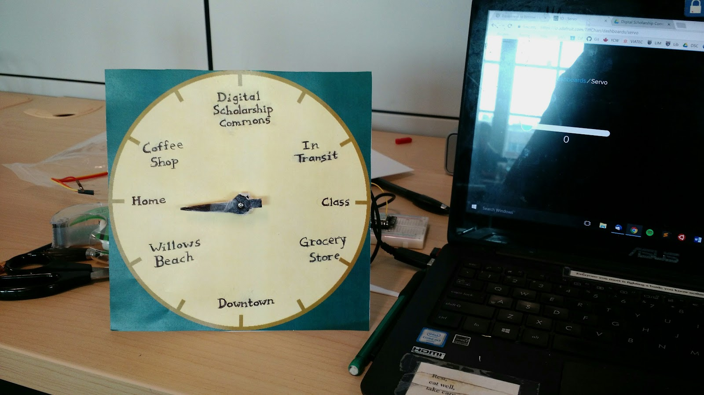
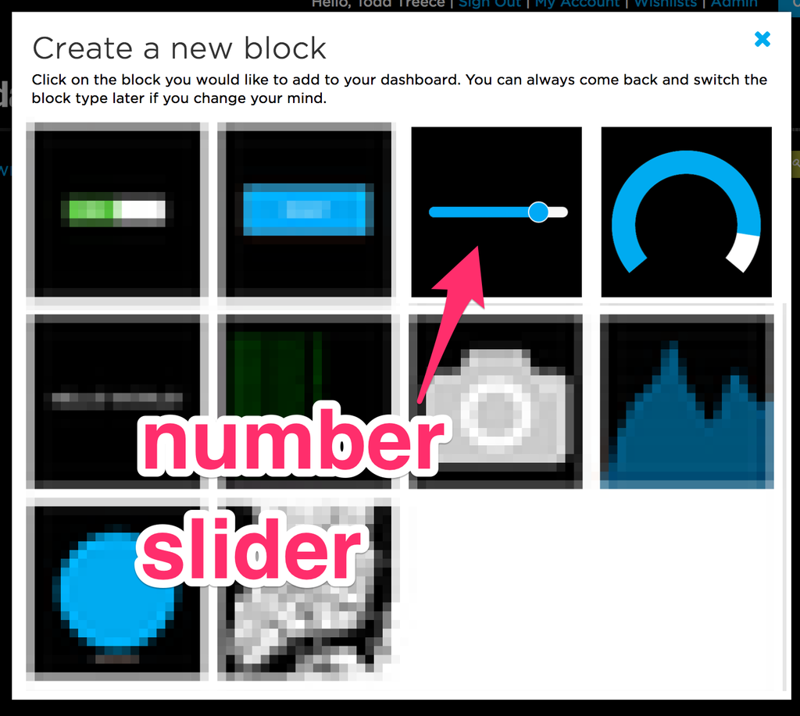
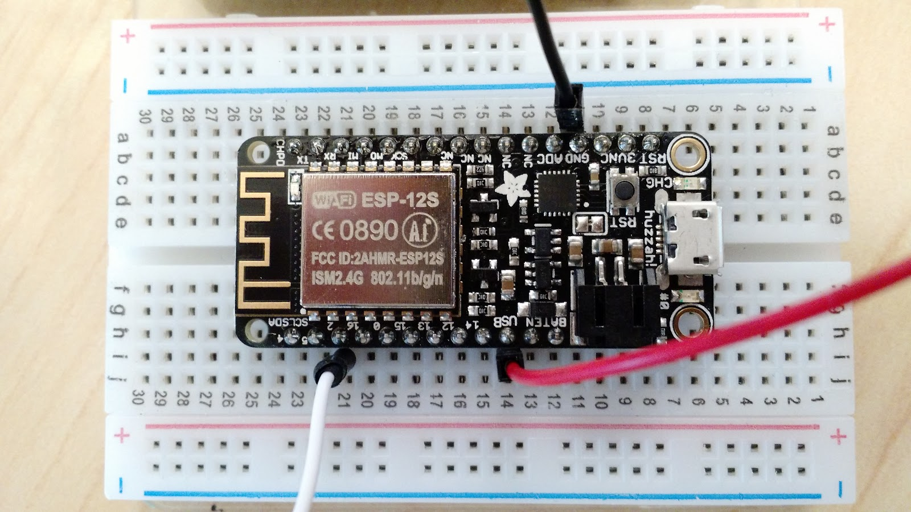
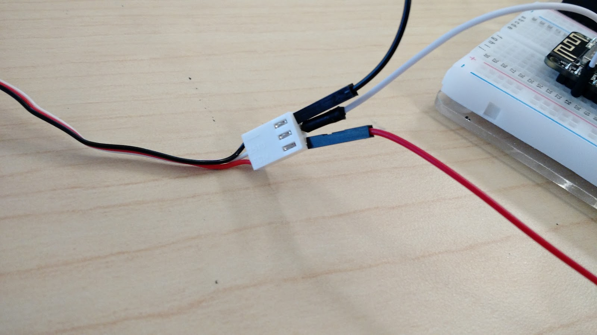
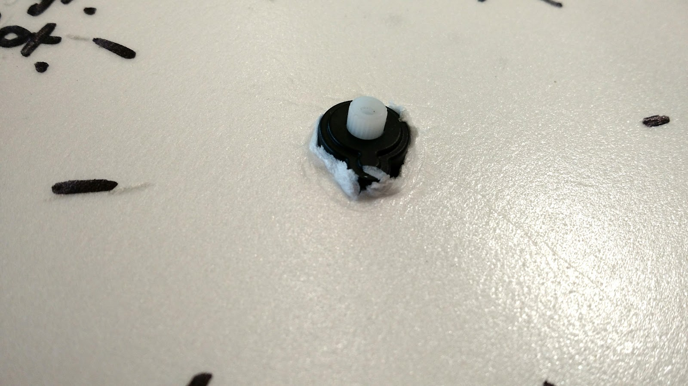
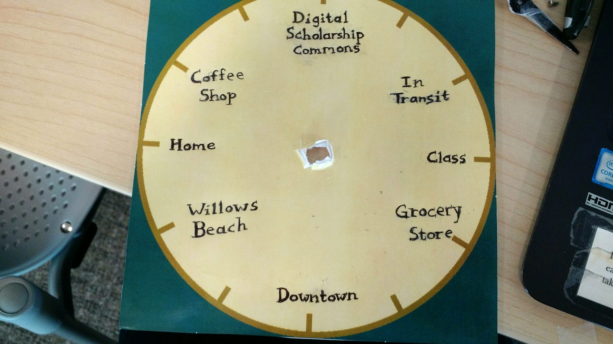

# Weasley Whereabouts Clock

_Adapted from [Adafruit IO: Basics - Servo](https://learn.adafruit.com/adafruit-io-basics-servo/overview) by Todd Treece_

If you or your group have any questions or get stuck as you work through this in-class exercise, please ask the instructor for assistance.  Have fun!

In the Harry Potter series, the Weasley whereabouts clock is a clock that shows the location of each Weasley rather than the time.

 &nbsp;&nbsp;&nbsp;&nbsp;&nbsp;**List of Materials**

-   Adafruit Feather HUZZAH board, breadboard, USB cable
-   Two pieces of foam board: 1 clock face, 1 small square
-   A sharpie or other writing/colouring implement
-   A servo motor
-   Three jumper wires (medium or long length)
-   Scotch tape
-   Small screwdriver
-   Scissors

 &nbsp;&nbsp;&nbsp;&nbsp;&nbsp;**Instructions**
&nbsp;&nbsp;&nbsp;&nbsp;&nbsp;

1.  Log into io.adafruit.com (if you haven’t created an account yet, you can do that now). Along the top menubar, click **IO**. Click **Feeds**. Click **+ New Feed** and name your feed “Servo”. A description is optional, but you can make one for your own reference. Click **Create**.
2.  Go to **Dashboards** on the top menubar. Click **+ New Dashboard** and name the new dashboard “Weasley Clock”. Once created, the new dashboard will appear on the page. Click on the name of your new dashboard
3.  For now, the dashboard is blank. Add a block by clicking the gear dropdown in the top right and selecting **+ Create New Block**. Select the **Slider** (see picture on right). When the pop-up prompts you to select a feed, pick the **Servo** feed you just created

    

4.  Fill out the block settings as follows:
    -   **0** for **Slider Min Value**
    -   **180** for **Slider Max Value**
    -   **10** for **Slider Step Size**
    Select **Create Block** to save it to your dashboard

     
    **Hardware**

5.  If your servo is arm-less, grab a screwdriver, plastic arm of your choice, and a screw from the baggies in the servo motor box. Screw the arm onto the motor

    
    

6.  Unplug the Feather from your laptop. Now we’ll connect the servo motor, a small motor with an arm attached, to Feather. We can send instructions from Arduino to the servo to control the position of the arm. Connect the servo as pictured to the side:
    -   **Red -> USB**
    -   **Black -> GND**
    -   **White -> Pin 2**
7.  Open the Arduino software. Go to **File -> Examples -> Adafruit IO Arduino -> adafruitio_16_servo**.  A new sketch should pop up. A sketch is a program or batch of instructions for our Feather HUZZAH
8.  Click on the **config.h** tab.  Edit the code to add your **IO_Username**, **IO_Key**, along with the **wifi username** and **password**. You can find your Adafruit IO credentials at [https://io.adafruit.com](https://io.adafruit.com) by clicking on the yellow **My Key** button in the top menu
9.  Connect Feather Huzzah to your laptop and make sure the right Board and Port settings are selected. Click **upload** (the right arrow icon in the top left corner of the window)

    

10.  Now try adjusting the slider on your computer. The servo should now move when you change the slider
11.  Poke a hole in the clock face for the motor. Use scissors, pen, or something else to poke a hole in the larger piece of foam board. Push the servo motor part-way through the board. Make sure it’s pushed through far enough—we don’t want the arm to hit the clock face as it turns! Test out the servo again to make sure it works
12.  Set your slider to **0** and note the position of the arm. Make a light mark on the foam where the arm is pointing. Unfortunately, the servo can only turn a maximum of 180 degrees, but we can make more positions (or places) anyway. For example, if we mark the clock face with 4 places at 12:00, 3:00, 6:00, and 9:00, the servo will only be able to point to 3 of them: that is, at 0, 90, and 180 degrees with the servo. If we mark 8 places, the servo could point to 5 of them (0, 45, 90, 135, and 180 degrees). However many places you choose to make, mark the position of the arm at each point
13.  Using a Sharpie or some other writing implement, write the place names onto your clock face at each of the positions you marked

     

14.  Unscrew the arm from the servo. Cut out a clock hand from the smaller piece of foam board and decorate it however you like. Tape the clock hand to the detached servo arm
15.  Position the arm/clock hand over the hole in the servo motor. Push the screw through the hand so it fits into the hole. Screw it in place. The screw should now go through the foam and into the servo motor, connecting your clock hand to the servo
16.  Now you can use your clock to tell people wherever you happen to be. Congratsㅡyer a wizard, Harry!

[NEXT STEP: Earn a Workshop Badge](informal-credentials.html)
